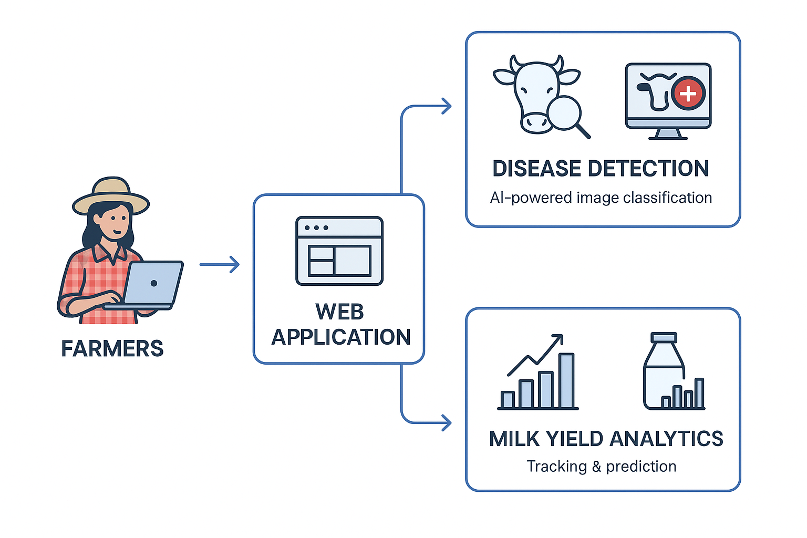

# Cattle Management Web app
This is a modern web-based cattle management application designed to help farmers efficiently monitor their livestock, detect diseases early using AI-powered image classification, track daily milk yields, and predict future production using regression analysis. This tool empowers farmers with data-driven insights to improve herd health and productivity.

## Available Features
## Feature 1 - Cattle Diseases Detection with Image Calssification model
Farmers can upload images of their cattle, and the system uses machine learning (CNN or Vision Transformer) to detect signs of common diseases such as:
- Mastitis (udder infections)
- Foot-and-Mouth Disease (FMD)
- Lumpy Skin Disease
- Respiratory Infections

### Training Results
Training is carried out with CNN image categorization and classification process to come up with custom CNN model. Following snaps shows results taken from Colabotory notebook including
- Training Testing (validation) acuraciies graph

- Confusion Metrix

- Testing with Images sample

## Feature 2 - Daily Milk Yield Tracking & Analytics
Farmers can log daily milk production per cow, and the system provides:
- Visual charts (line, bar graphs) for trends
- Average yield calculations
- Comparison between cows

## Feature 3 - Future Prediction of Milk Yield data
Using historical milk yield data, the system applies linear regression 

**Legend:**
- 🟨 Predicted Milk Yield (Yellow Line)
- 🟪 Received Milk (Purple Line)

## Architecture

## Available Scripts

In the project directory, you can run:

### `npm start`

Runs the app in the development mode.\
Open [http://localhost:3000](http://localhost:3000) to view it in your browser.

The page will reload when you make changes.\
You may also see any lint errors in the console.

### `npm test`

Launches the test runner in the interactive watch mode.\
See the section about [running tests](https://facebook.github.io/create-react-app/docs/running-tests) for more information.

### `npm run build`

Builds the app for production to the `build` folder.\
It correctly bundles React in production mode and optimizes the build for the best performance.

The build is minified and the filenames include the hashes.\
Your app is ready to be deployed!

See the section about [deployment](https://facebook.github.io/create-react-app/docs/deployment) for more information.

### `npm run eject`

**Note: this is a one-way operation. Once you `eject`, you can't go back!**

If you aren't satisfied with the build tool and configuration choices, you can `eject` at any time. This command will remove the single build dependency from your project.

Instead, it will copy all the configuration files and the transitive dependencies (webpack, Babel, ESLint, etc) right into your project so you have full control over them. All of the commands except `eject` will still work, but they will point to the copied scripts so you can tweak them. At this point you're on your own.

You don't have to ever use `eject`. The curated feature set is suitable for small and middle deployments, and you shouldn't feel obligated to use this feature. However we understand that this tool wouldn't be useful if you couldn't customize it when you are ready for it.

## Learn More

You can learn more in the [Create React App documentation](https://facebook.github.io/create-react-app/docs/getting-started).

To learn React, check out the [React documentation](https://reactjs.org/).

### Code Splitting

This section has moved here: [https://facebook.github.io/create-react-app/docs/code-splitting](https://facebook.github.io/create-react-app/docs/code-splitting)

### Analyzing the Bundle Size

This section has moved here: [https://facebook.github.io/create-react-app/docs/analyzing-the-bundle-size](https://facebook.github.io/create-react-app/docs/analyzing-the-bundle-size)

### Making a Progressive Web App

This section has moved here: [https://facebook.github.io/create-react-app/docs/making-a-progressive-web-app](https://facebook.github.io/create-react-app/docs/making-a-progressive-web-app)

### Advanced Configuration

This section has moved here: [https://facebook.github.io/create-react-app/docs/advanced-configuration](https://facebook.github.io/create-react-app/docs/advanced-configuration)

### Deployment

This section has moved here: [https://facebook.github.io/create-react-app/docs/deployment](https://facebook.github.io/create-react-app/docs/deployment)

### `npm run build` fails to minify

This section has moved here: [https://facebook.github.io/create-react-app/docs/troubleshooting#npm-run-build-fails-to-minify](https://facebook.github.io/create-react-app/docs/troubleshooting#npm-run-build-fails-to-minify)
